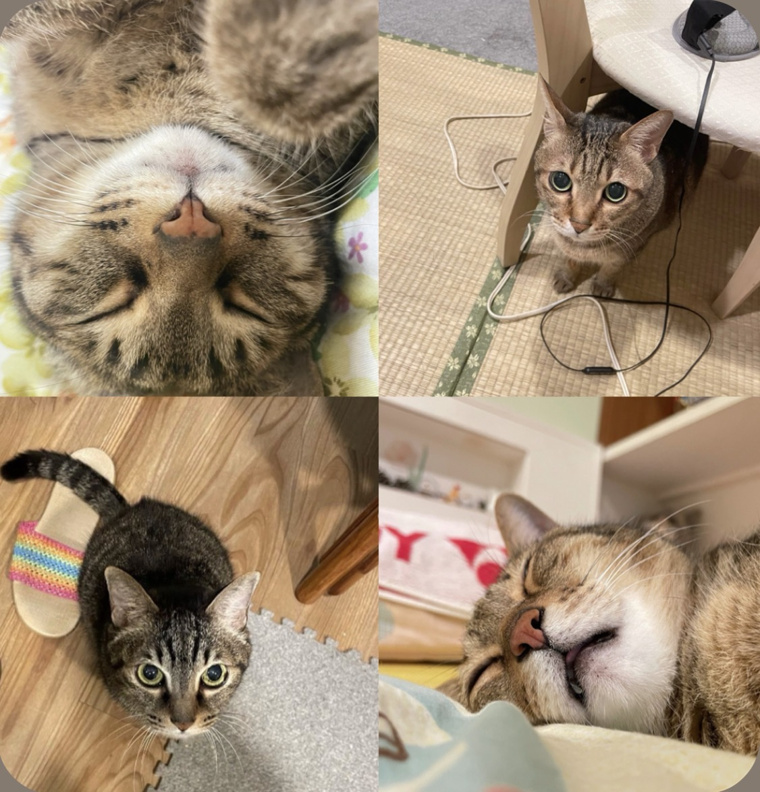

  

<h2 align="center">Hi, I'm Yuu •ᴗ•</h2>

  <b>Student from Taiwan 🇹🇼</b>

  <!-- 兩行學歷統一改成黑色質感的徽章 -->
  

  

---

### 📌 About Me

-  **Bioinformatics** & **Data Analysis** <!-- 有興趣且目前專注投入的研究領域。 -->
-  **System Analysis** <!-- 具備系統分析與專案規劃的實作能力。 -->
-  **Hobbyist Illustrator** <!-- 喜歡畫畫，是個業餘插畫愛好者。 -->
-  **Cat Person** <!-- 個不折不扣的貓奴。 -->

---

### 🛠️ Languages & Tools

#### 💻 Programming & Data

  
  
  
  

<!-- 貓咪區塊：隱藏或顯示可自行決定 -->
<!--
---

### 🐾 My Cats

  <table>
    <tr>
      <td align="center">
        
         
        <b>🍓 Strawberry (♀) &nbsp;&nbsp;┊&nbsp;&nbsp; 🍮 Pudding (♂)</b>
      </td>
    </tr>
  </table>

-->
